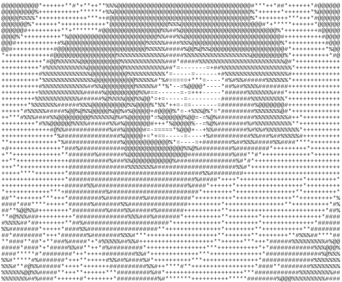

  

🌸 ・ 。 ・ 🌸 ・ 。 ・ 🌸 ・ 。 ・ 🌸

 

End-to-end software builder focused on reliable, scalable, and secure systems. I do my best work in small teams that move fast from initial planning all the way to production, relying on CI/CD and comprehensive testing instead of just good vibes. I like keeping things structured, except when I'm building games in Unity.

**▰▰▱ Languages ▱▰▰**

**▰▰▱ Frameworks & Libraries ▱▰▰**

**▰▰▱ Databases ▱▰▰**

**▰▰▱ DevOps & CI/CD ▱▰▰**

**▰▰▱ Game Dev ▱▰▰**

 

🌸 ・ 。 ・ 🌸 ・ 。 ・ 🌸 ・ 。 ・ 🌸

 

